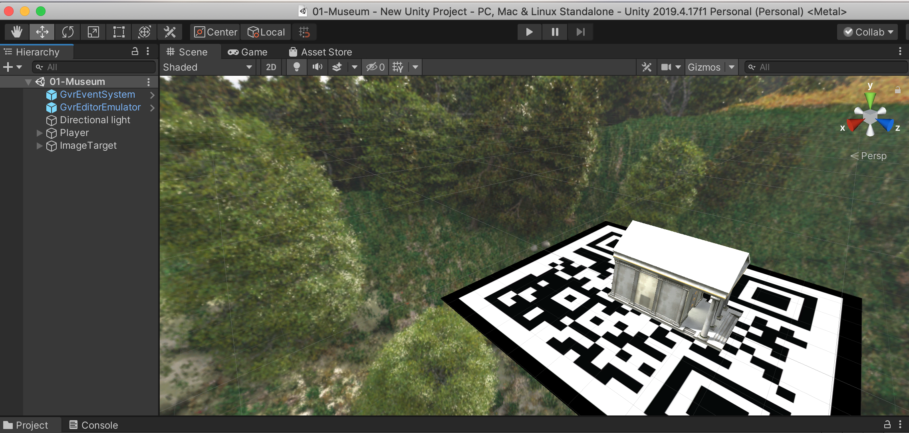
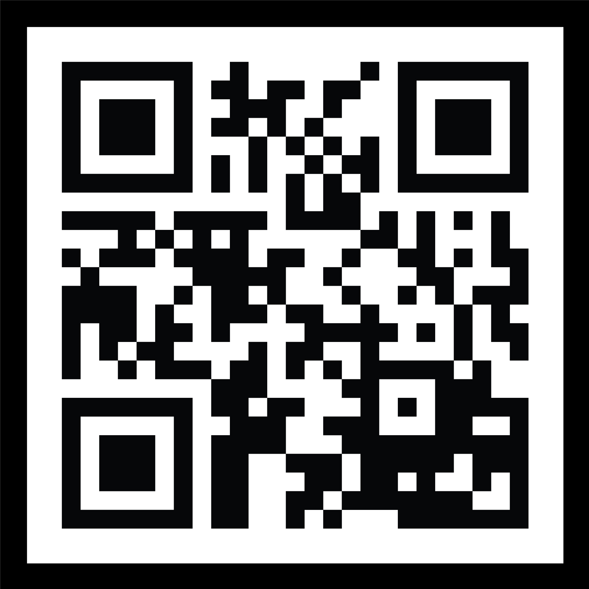

# Gazi Üniversitesi - Bilgisayar Bilimleri Yüksek Lisans Sanal Gerçeklik Vize Projesi
# NUR DESTEGÜL - 208010799

EscapeMuseumVize
-------------------------------------------------------------------------------
Bu projede Vuforia Engine kullanılarak EscapeMuseum oyunundaki müzenin önceden tanımlanmış bir QR kod üzerinde üç boyutlu gösterilmesi yapılmıştır.

- Unity Versiyon: 2019.4.17f1 (LTS)
- Vuforia Engine Versiyon: 8.1.12
- MacOs işletim sisteminde geliştirildi.

# Kurulum için Yapılanlar
- [Vuforia](https://developer.vuforia.com/) 'a üye olunur.
- Daha sonrasında projemiz için License Manager kısmından bir lisans oluşturulur.
- Projemizde kullanacağımız QR kod Vuforia üzerinden veritabanı olarak eklenir. Böylece, Unity üzerinde kamera için ImageTarget olarak QR kodumuzu gösterdiğimizde Vuforianın istediğimiz 3 boyutlu nesnemizi göstermesi sağlanmış olur.
- Unity'ye, Vuforia Editörü ve kendi oluşturduğumuz veritabanı paketleri Assets --> Import Package --> Custom Package denilerek eklenir. Böylece, Vuforia kütüphanesini Unity projemizde kullanabilir oluruz.
- Daha sonrasında projemizde olan MainCamera kaldırılır ve yerine Vuforia'nın, ARCamerası eklenir. Game Object --> Vuforia Engine --> AR Camera . Daha sonra Vuforia License anahtarımız sitemizden kopyalanarak buradaki alanına yapıştırılır ki kameramız çalışsın.
- ImageTarget olarak da Vuforia üzerinde tanımladığımız QR kod veritabanı gösterilir. Game Object --> Vuforia Engine --> Image . Burada dikkat edilmesi gereken husus Image Target Behaviour altında, UserDefined seçip kendi veritabanımızı göstermek ve sahnemizde QR kodu görüyor olmamızdır.

# Ekran Çıktıları

## Proje Demosu

## Unity Sahne Görünümü

## Kullanılan QR Kod

# Referanslar
- Vuforia kurulumu ve QR kodunun kullanımında [şu](https://www.youtube.com/watch?v=8pVqRzZ6cwc) ve [bu](https://www.youtube.com/watch?v=XEIYK6KjI6E) YouTube videolarından yardım alındı.
- Proje içindeki müze yapısı ilk ödevden export edilip yeni bir projeye import edildi. Müze dışındaki diğer nesneler ilk sahneden silindi.